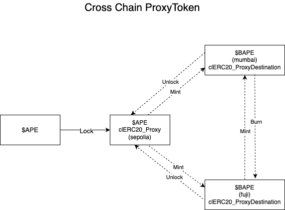
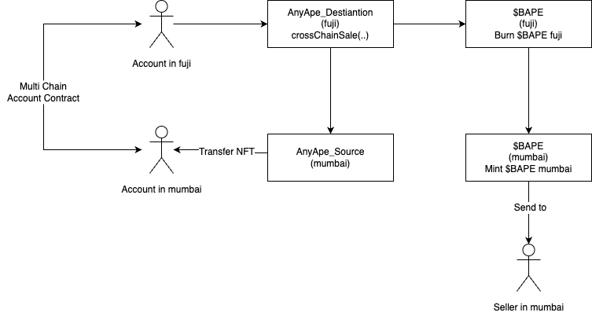

# AnyApe Smart Contract Repository

Welcome to the AnyApe Smart Contract repository. This collection features the core contracts used for standardizing cross-chain tokens through Chainlink's Cross-Chain Interoperability Protocol (CCIP). Additionally, it serves as the foundation that power the AnyApe NFT cross-chain marketplace

## Core Contracts

### **Token Proxy**

ERC20 Proxy for manage cross-chain tokens within CCIP, this segment consists of two primary contracts:

#### a) clERC20Proxy_Source.sol
- **Purpose**: Intended for deployment on the source blockchain (e.g., Ethereum). If a token, such as $APE, is already live on Ethereum and there's an interest in making it available cross-chain, this is the contract to deploy.

#### b) clERC20Proxy_Destination.sol
- **Purpose**: This needs to be deployed on each destination blockchain where you desire the token's presence. As a result, the token becomes available on other blockchains, in this case represented as $BAPE (Bridged APE).

#### **Token Proxy Flows Diagram**

*Diagram illustrating processes of the token proxy.*

##### Operational Overview:
- **Locking and Minting**: Begin by deploying the `clERC20Proxy_Source.sol` on the source blockchain (e.g., Ethereum). To transfer your tokens to a different blockchain, the source contract will lock the genuine tokens. Subsequently, it signals the destination contract to mint equivalent bridged tokens using the `lockAndMint(..)` function.
  
- **Burning and Unlocking**: To reclaim the original tokens in the source blockchain, the $BAPE tokens on the destination chain need to be burned. Executing the `burnAndMintOrUnlock(..)` function accomplishes this. It burns the bridged tokens on the destination chain and releases the original tokens on the source chain. Furthermore, it allows bridging of your $BAPE to alternate destination chains too - executing a burn action on one and minting on the other.

### **AnyApe NFT Cross-Chain Marketplace**

This segment revolves around the cross-chain marketplace designed for NFTs and comprises two core contracts:

#### 1. AnyApe_Source
- **Purpose**: This is slated for deployment on a source blockchain, say Mumbai. It facilitates users in listing their Mumbai-resident NFTs.

#### 2. AnyApe_Destination
- **Purpose**: Deploy this on the destination blockchain (like Fuji) to empower users to acquire NFTs originating from source chains on the destination platform.

NFTs can be sold using two methods:

#### a) Native Sale
This mode enables users to procure the NFT on the source chain using that chain's inherent token. For instance, an NFT on Mumbai could be bought using $BAPE Mumbai.

#### **Native Sale Flow Diagram**

*Diagram showcasing the flow of a direct sale within the marketplace.*

#### b) Cross Chain Sale
This mode empowers users to purchase NFTs using tokens from a chain different from the source. As an illustrative example, an NFT from Mumbai can be acquired using $BAPE from Fuji. This cross-chain capability is a direct benefit of the token proxy. The underlying mechanism involves burning the Fuji-based $BAPE and minting an equal volume to the seller's wallet in $BAPE Mumbai.

#### **Cross Chain Sale Flow Diagram**

*Diagram detailing the flow of a cross-chain sale in the marketplace.*

##### Operational Overview:
1. **Listing**: NFT owners list their offerings on the `AnyApe_Source` contract.
2. **Native Sale**: Potential buyers can directly acquire the NFT on the source blockchain using its native token (like $BAPE Mumbai).
3. **Cross Chain Sale**: Buyers from alternate chains (e.g., Fuji) have the option to acquire the NFT. This entails burning the purchasing party's $BAPE Fuji and crediting an equivalent amount to the seller in $BAPE Mumbai.
